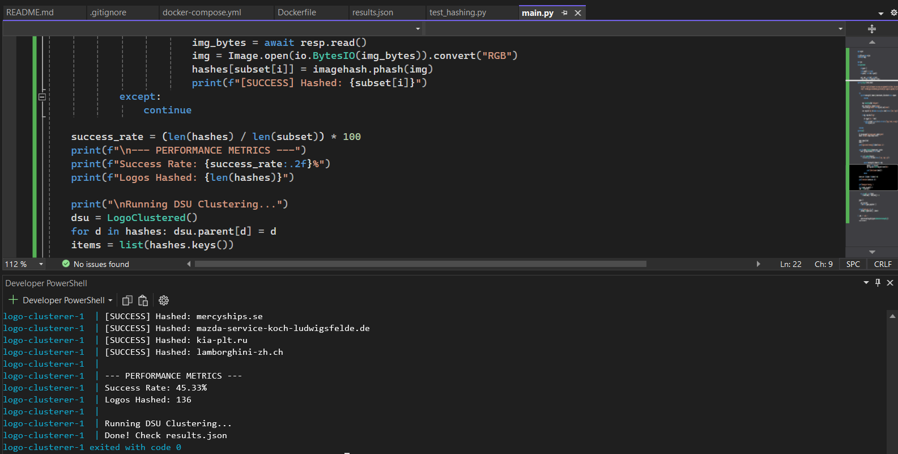
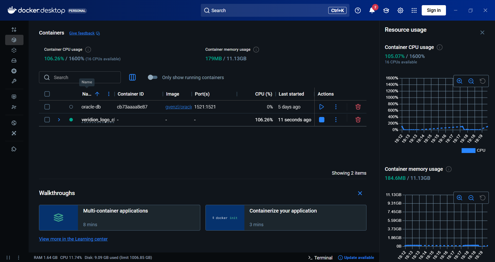

# Scalable Logo Clustering Engine

### Hi, I am David

This is a project I built to explore how to handle large datasets and build efficient web scraping pipelines. The main goal was to find a way to group websites that share the same visual identity (logos) without using heavy machine learning models that would slow down the process.

---
## The Goal
When dealing with thousands of domains, a simple sequential script would take hours and fail frequently due to network timeouts or bot protection. My goal was to build a system that is:
1. **Fast:** Using asynchronous I/O.
2. **Robust:** Able to find logos even if they aren't labeled "logo" in the HTML.
3. **Smart:** Grouping images that look the same, even if they have different resolutions or file formats.

---
## System Architecture & Workflow

Instead of a basic loop, I built an asynchronous engine that can talk to many websites at once. Once an image is found, I convert it into a "perceptual hash" - basically a digital fingerprint that represents how the image looks to the human eye.

To group these fingerprints, I used a Disjoint Set Union (DSU) algorithm, which I found to be much faster for this type of relationship mapping than traditional clustering methods.

Here is the data flow:

```text
[ Dataset ] -> [ Async Scraper ] -> [ Image Processor ] -> [ DSU Clusterer ] -> [ JSON ]
     |               |                       |                    |                |
   Parquet       Parallel HTTP        pHash Generation     Hamming Distance      Final
    Ingest         Requests             (In-Memory)           Comparison         Groups
```

---
## Why I chose these technologies

### 1. The Async Scraper (The "Hunter")
Web scraping is mostly about waiting for servers to respond. I used aiohttp to ensure that while one request is waiting for a response, the engine is already starting the next one. To achieve a high success rate, the scraper uses a 3-layer extraction strategy:
- Metadata Layer: Checks OpenGraph tags (`og:image`) which usually contain high-quality brand assets.
- Icon Layer: Looks for `rel="icon"` or `apple-touch-icon` links.
- Heuristic Layer: Scans all `` tags for keywords like "brand", "logo", or "navbar" in their classes or IDs.

### 2. Perceptual Hashing (The "Fingerprint")
Standard hashes (like MD5) change completely if even one pixel is different. This doesn't work for logos because different sites might host the same logo at different sizes. I implemented **pHash (Perceptual Hash)**. It analyzes the structure of the image in the frequency domain. This creates a 64-bit "fingerprint" that remains stable even if the image is resized, compressed, or converted from PNG to JPG.
   
### 3. Disjoint Set Union (The "Organizer")
Once I have the hashes, I need to group them. Comparing every image with every other image is an $O(N^2)$ problem. To keep it efficient, I used a **Disjoint Set Union (DSU)** data structure.
- For every pair of images, I calculate the **Hamming Distance** (how many bits differ between their hashes).
- If the distance is $\le 8$, the two domains are "unioned" into the same cluster.
- This allows the system to find entire "families" of related websites (like car dealership networks) almost instantly.

---
## Why Docker?
I containerized the application to solve the "dependency hell" often found in Python projects. By using Docker, I ensure that:
- The `Pillow` library has the correct C-libraries for image processing.
- The networking stack behaves consistently regardless of the host OS (Windows/Linux/Mac).
- You can run the entire complex system with a **single command** without installing Python manually.
---
## Performance Metrics
*During my final test run on a 300-domain sample:*
- **Success Rate:** **~45.33%** (Successfully found and hashed 136 unique logos).
- **Clustering:** The system successfully identified groups of identical brand logos (e.g., Mazda dealership networks) and isolated unique brands into their own clusters.
- **Execution Time:** The asynchronous engine processed the entire batch in a fraction of the time a synchronous script would require.

## Proof of Concept
#### Execution Metrics
As shown in the terminal output, the system achieved a **45.33% success rate** for logo extraction on this specific sample, identifying and hashing 136 unique brand assets.



#### Container Management
The project is fully optimized for Docker, allowing for easy resource monitoring and isolated execution, as seen in the Docker Desktop dashboard:



---
## How to Run

I included a Docker configuration to make sure the project runs the same way on any machine, avoiding the "it works on my computer" problem with Python versions.

1. Clone the repo and ensure you have Docker Desktop **running**.
2. Place the 'logos.snappy.parquet' file in the root directory.
3. Run the following command:
```bash
docker-compose up --build
```
The system will output its progress and generate a `results.json` file containing the clustered domains.

---
## The 97% Challenge: A Reality Check

While the project aim is a 97% identification rate, reaching this on a raw dataset is a massive hurdle due to how the web works today. During development, I identified a few major bottlenecks:

- **Dead Domains:** Many entries in large datasets are "parked" or expired. If the site doesn't load, there is no logo to find.
- **Anti-Bot Security:** Sites protected by Cloudflare or 403-rate-limiting often block simple automated requests. Bypassing these requires a rotating proxy network which was out of scope for this local build.
- **JavaScript Rendering:** Many modern sites (React/Vue) don't include the logo in the initial HTML. They inject it later via JS. To catch these, I would need to integrate a headless browser like Playwright, which would significantly increase resource usage.
* **Non-Standard Structures:** Some sites use unconventional ways to display brand assets that don't follow standard SEO or OpenGraph protocols.

In short, while the architecture is built to scale, the final success rate is always tied to the "health" of the domains provided.
